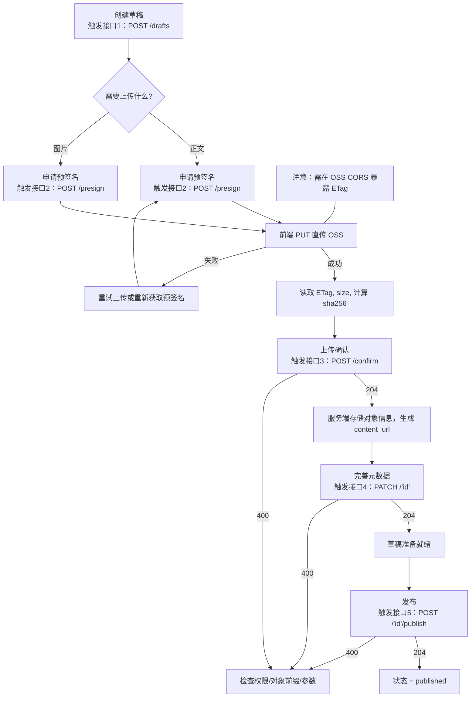

### 首页·知文（KnowPost）发布模块

说明：本模块支持图文帖的草稿创建、内容上传确认、元数据完善与发布。所有接口均需要携带 Access Token 鉴权。

---

- 路径：`POST /api/v1/knowposts/drafts`
  - 鉴权：需要携带 `Authorization: Bearer <access_token>`
  - 内容类型：`application/json`
  - 请求体：无
  - 成功响应：
    ```json
    { "id": "1234567890123" }
    ```
  - 说明：因雪花 ID 超出 JS 安全整数范围，`id` 以字符串返回，请前端按字符串存储与传递。
  - 可能错误：
    - `BAD_REQUEST`：请求不合法（例如服务内部参数错误）

---

- 路径：`POST /api/v1/knowposts/{id}/content/confirm`
  - 鉴权：需要携带 `Authorization: Bearer <access_token>`
  - 内容类型：`application/json`
  - 请求体（必填）：
    ```json
    {
      "objectKey": "posts/1234567890123/content.jpg",
      "etag": "\"F4BAAC...\"",
      "size": 2456789,
      "sha256": "b1946ac92492d2347c6235b4d2611184..."
    }
    ```
  - 成功响应：`204 No Content`
  - 生成规则：服务端会根据 `objectKey` 生成 `content_url`（优先使用 `oss.publicDomain`，否则使用 `https://{bucket}.{endpoint}/{objectKey}`），并写入 `content_etag`、`content_size`、`content_sha256`。
  - 可能错误：
    - `BAD_REQUEST`：草稿不存在或无权限（`id` 与当前用户不匹配）

---

- 路径：`PATCH /api/v1/knowposts/{id}`
  - 鉴权：需要携带 `Authorization: Bearer <access_token)`
  - 内容类型：`application/json`
  - 请求体（可选字段，未提交的字段保持不变）：
    ```json
    {
      "title": "我的图文帖标题",
      "tagId": 100,
      "tags": ["java", "编程"],
      "imgUrls": [
        "https://cdn.example.com/images/a.jpg",
        "https://cdn.example.com/images/b.jpg"
      ],
      "visible": "public|followers|school|private|unlisted",
      "isTop": false
    }
    ```
  - 成功响应：`204 No Content`
  - 说明：`tags` 与 `imgUrls` 存储为 JSON 数组字符串；仅更新提交的字段。
  - 可能错误：
    - `BAD_REQUEST`：草稿不存在或无权限（`id` 与当前用户不匹配）
    - `BAD_REQUEST`：JSON 处理失败（序列化异常）

---

- 路径：`POST /api/v1/knowposts/{id}/publish`
  - 鉴权：需要携带 `Authorization: Bearer <access_token>`
  - 内容类型：`application/json`
  - 请求体：无
  - 成功响应：`204 No Content`
  - 行为：设置状态为 `published`，并写入 `publish_time` 为当前时间。
  - 可能错误：
    - `BAD_REQUEST`：草稿不存在或无权限（`id` 与当前用户不匹配）

---

- 预签名直传接口
  - 路径：`POST /api/v1/storage/presign`
  - 鉴权：`Authorization: Bearer <access_token>`
  - 请求体示例：
    ```json
    {
      "scene": "knowpost_content", // 或 "knowpost_image"
      "postId": "1234567890123",
      "contentType": "text/markdown",
      "ext": ".md"
    }
    ```
  - 成功响应示例：
    ```json
    {
      "objectKey": "posts/1234567890123/content.md",
      "putUrl": "https://oss-example.aliyuncs.com/bucket/...",
      "headers": {
        "Content-Type": "text/markdown"
      },
      "expiresIn": 600
    }
    ```

---

#### 枚举与约束
- `type`：目前固定为 `image_text`（一期仅支持图文）。
- `visible`：`public`｜`followers`｜`school`｜`private`｜`unlisted`。
- `status`：默认 `draft`，发布后为 `published`。
  - 删除为软删除：状态置为 `deleted`（记录保留）。
- `objectKey` 前缀建议：`posts/{postId}/...`，后端可按前缀做校验，避免越权引用对象。
- `etag` 说明：直传单对象时常等于 MD5；分片上传时不是 MD5，但仍可用于变化标识与并发控制。

#### 典型发布流程
1. 创建草稿：`POST /api/v1/knowposts/drafts` → 获取 `id`。
2. 前端直传正文到阿里云 OSS（预签名接口暂未在本文档内定义）。
3. 上传成功后回传确认：`POST /api/v1/knowposts/{id}/content/confirm`。
4. 完善元数据：`PATCH /api/v1/knowposts/{id}`（标题、标签、图片等）。
5. 发布：`POST /api/v1/knowposts/{id}/publish`。

---

#### 发布流程技术方案（前端参考）
- 鉴权与通用约定
  - 所有请求均需携带 `Authorization: Bearer <access_token>`，缺失或失效返回 `401`。
  - 所有写操作均以 `id + creator_id` 约束，避免越权；重复调用为幂等更新（发布重复调用无副作用）。

- 对象命名与内容格式建议
  - 正文（图文）：使用 `text/markdown` 或 `text/html` 存储。
    - `objectKey` 建议：`posts/{postId}/content.md` 或 `posts/{postId}/content.html`。
  - 图片：独立上传，统一放置到帖子目录下。
    - `objectKey` 建议：`posts/{postId}/images/{yyyyMMdd}/{index}-{hash}.jpg`。
  - 服务器会对 `objectKey` 前缀进行约束（如必须以 `posts/{postId}/` 开头），防止引用非本帖对象。

- 预签名直传接口
  - 路径：`POST /api/v1/storage/presign`
  - 鉴权：`Authorization: Bearer <access_token>`
  - 请求体示例：
    ```json
    {
      "scene": "knowpost_content", // 或 "knowpost_image"
      "postId": "1234567890123",
      "contentType": "text/markdown",
      "ext": ".md"
    }
    ```
  - 成功响应示例：
    ```json
    {
      "objectKey": "posts/1234567890123/content.md",
      "putUrl": "https://oss-example.aliyuncs.com/bucket/...",
      "headers": {
        "Content-Type": "text/markdown"
      },
      "expiresIn": 600
    }
    ```
  - 说明：
    - 客户端需按返回的 `headers` 执行 `PUT` 请求；`expiresIn` 为上传 URL 的有效期（建议 5–10 分钟）。
    - URL 仅用于上传；公开访问 URL 由服务端在确认时根据 `objectKey` 生成并写入 `content_url`。
    - 由于雪花 ID 超出 JS 安全整数范围，`postId` 以字符串传递，服务端解析为 long。

- 上传与校验（前端执行）
  - 使用 `PUT {putUrl}` 直传，设置 `Content-Type` 为返回值；成功后在 HTTP 响应头中获取 `ETag`（通常含双引号，如 `"ABC..."`）。
  - 计算正文的 SHA-256（可选但推荐）：
    - Web Crypto API 示例：
      ```js
      const buf = await file.arrayBuffer();
      const digest = await crypto.subtle.digest('SHA-256', buf);
      const hex = Array.from(new Uint8Array(digest)).map(b => b.toString(16).padStart(2, '0')).join('');
      ```
  - 获取 `size`（字节）并在后续确认接口中一并提交。

- 上传成功后回传确认（服务端验收）
  - 路径：`POST /api/v1/knowposts/{id}/content/confirm`
  - 请求体：`objectKey`、`etag`、`size`、`sha256`
  - 行为：后端校验并写入 `content_object_key/content_etag/content_size/content_sha256`，生成 `content_url`。
  - 注意：分片上传的 `ETag` 与内容 MD5 不一致，若需强校验请同时提供 `sha256`。

- 元数据完善与发布
  - `PATCH /api/v1/knowposts/{id}`：提交 `title/tags/imgUrls/visible/isTop` 等；`tags/imgUrls` 以 JSON 数组字符串存储。
  - `POST /api/v1/knowposts/{id}/publish`：置 `status=published` 并写入 `publish_time`。

- 幂等与重试策略
  - 预签名获取：可重复请求，产生不同 `putUrl`；`objectKey` 建议稳定（由后端生成）。
  - 直传：网络失败可重试；如覆盖产生新 `ETag`，以最后一次成功的 `ETag` 为准。
  - 确认与元数据更新：幂等；重复提交会覆盖同字段。
  - 发布：重复调用无副作用（已发布不变）。

  - 错误处理与可观测性建议
  - 上传失败：提示前端检查网络、URL是否过期（`expiresIn`）、`Content-Type` 是否一致。
  - 确认失败（`BAD_REQUEST`）：检查 `id` 与当前用户是否匹配、`objectKey` 前缀是否符合约束。
  - 建议在客户端记录 `postId/objectKey/etag/size/sha256` 以便问题追踪。

---

#### 发布流程（Mermaid 流程图）



---

#### 首页 Feed 查询
- 路径：`GET /api/v1/knowposts/feed`
  - 鉴权：不需要（公开可见的已发布内容）
  - 查询参数：
    - `page`：页码，从 1 开始，默认 `1`
    - `size`：每页条数，默认 `20`，最大 `50`
  - 成功响应示例：
    ```json
    {
      "items": [
        {
          "id": "1234567890123",
          "title": "Python从入门到精通",
          "description": "掌握 Python 的核心能力…",
          "coverImage": "https://cdn.example.com/images/a.jpg",
          "tags": ["Python", "编程"],
      "authorAvatar": "https://cdn.example.com/avatars/u1.png",
      "authorNickname": "张老师",
      "tagJson": "[\"Python\",\"数据分析\"]",
      "likeCount": 120,
      "favoriteCount": 56,
      "liked": false,
      "faved": false
        }
      ],
      "page": 1,
      "size": 20,
      "hasMore": true
    }
    ```
  - 说明：
    - 列表仅返回公开（`visible=public`）且已发布（`status=published`）的内容；置顶在前，其次按 `publish_time` 倒序。
    - 每条 `items` 增加 `likeCount`、`favoriteCount`、`liked`、`faved` 字段：
      - `likeCount` / `favoriteCount` 为全局计数；与基础列表一并缓存（约 60s + 随机抖动），可能存在秒级延迟。
      - `liked` / `faved` 为用户维度状态；若未登录则返回 `false`；公开 Feed 中该状态不参与缓存，仅在返回时覆盖，避免不同用户相互干扰。

---

#### 知文详情
- 路径：`GET /api/v1/knowposts/detail/{id}`
  - 鉴权：公开（published+public 可匿名访问；非公开内容需作者本人访问）
  - 成功响应示例：
    ```json
    {
      "id": "1234567890123",
      "title": "商业思维与创业指南",
      "description": "课程摘要…",
      "contentUrl": "https://cdn.example.com/posts/123/content.md",
      "images": [
        "https://cdn.example.com/posts/123/images/a.jpg",
        "https://cdn.example.com/posts/123/images/b.jpg"
      ],
      "tags": ["商业", "创业", "管理"],
      "authorAvatar": "https://cdn.example.com/avatars/u1.png",
      "authorNickname": "王经理",
      "authorTagJson": "[\"商业\",\"创业\"]",
      "likeCount": 120,
      "favoriteCount": 56,
      "liked": false,
      "faved": false,
      "isTop": false,
      "visible": "public",
      "type": "image_text",
      "publishTime": "2025-10-28T12:00:00Z"
    }
    ```
  - 说明：
    - `images` 返回该知文所有图片，便于前端左右滑动预览；取自 `img_urls`。
    - `likeCount` 与 `favoriteCount` 为真实计数；计数来源于计数模块，读写采用一致性控制，可能存在秒级延迟。
    - `liked` / `faved` 为用户维度状态；未登录时返回 `false`；登录时依据位图实时判断，存在毫秒级读取开销。
    - 非公开内容访问规则：若当前内容非 `public` 或未发布，仅作者本人可访问；否则返回错误。

---

#### 我的知文查询
- 路径：`GET /api/v1/knowposts/mine`
  - 鉴权：需要携带 `Authorization: Bearer <access_token>`
  - 查询参数：
    - `page`：页码，从 1 开始，默认 `1`
    - `size`：每页条数，默认 `20`，最大 `50`
  - 成功响应示例：与首页 Feed 相同结构（`FeedPageResponse`）：
    ```json
    {
      "items": [
        {
          "id": "1234567890123",
          "title": "我的已发布知文",
          "description": "摘要…",
          "coverImage": "https://cdn.example.com/images/a.jpg",
          "tags": ["Java","后端"],
      "authorAvatar": "https://cdn.example.com/avatars/me.png",
      "authorNickname": "我",
      "tagJson": "[\"Java\",\"后端\"]",
      "likeCount": 120,
      "favoriteCount": 56,
      "liked": true,
      "faved": false
        }
      ],
      "page": 1,
      "size": 20,
      "hasMore": true
    }
    ```
  - 说明：
    - 仅返回当前用户自己“已发布”（`status=published`）的知文；包含任意 `visible`（自己可见）。
    - 排序规则：置顶在前（`is_top`），其次按 `publish_time` 倒序。
    - 性能优化：服务端对用户维度列表做短期旁路缓存（约 30–50 秒随机抖动）；数据库建议建立索引 `(creator_id, status, publish_time)`。
    - `coverImage` 取自 `imgUrls` 的第一张图片；`tags` 为字符串数组；`tagJson` 为作者的领域标签（JSON 字符串，直接来自 `users.tags_json`）。
    - 用户维度列表缓存键格式：`feed:mine:{userId}:{size}:{page}`；缓存 TTL 为 `30s + 随机抖动(0–20s)`；计数与列表一并缓存；`liked`/`faved` 也随响应一并缓存（用户维度），但可能因操作造成 30s 内的短暂延迟。
    - 为保证一致性，写操作（内容确认、元数据更新、发布）在数据库更新前后对 `feed:*` 做缓存双删：更新前删除一次、更新后延迟约 200ms 再删除一次，避免并发写回旧值。

---

#### 编辑接口

- 路径：`PATCH /api/v1/knowposts/{id}/top`
  - 鉴权：需要携带 `Authorization: Bearer <access_token>`
  - 内容类型：`application/json`
  - 请求体：
    ```json
    { "isTop": true }
    ```
  - 成功响应：`204 No Content`
  - 行为：仅更新 `is_top` 字段，需为作者本人；触发首页与「我的知文」缓存双删。

- 路径：`PATCH /api/v1/knowposts/{id}/visibility`
  - 鉴权：需要携带 `Authorization: Bearer <access_token>`
  - 内容类型：`application/json`
  - 请求体：
    ```json
    { "visible": "public|followers|school|private|unlisted" }
    ```
  - 成功响应：`204 No Content`
  - 行为：更新可见性；入参校验为上述枚举之一；触发首页与「我的知文」缓存双删。

- 路径：`DELETE /api/v1/knowposts/{id}`
  - 鉴权：需要携带 `Authorization: Bearer <access_token>`
  - 请求体：无
  - 成功响应：`204 No Content`
  - 行为：软删除（将 `status` 更新为 `deleted`）；触发首页与「我的知文」缓存双删。

说明：为提升性能与一致性，以上编辑接口在数据库更新前后均执行缓存双删：
- 公共首页缓存键：`feed:public:{page}:{size}`
- 用户维度缓存键：`feed:mine:{userId}:{size}:{page}`（TTL 30–50 秒）

---

#### 生成知文描述（LLM）
- 路径：`POST /api/v1/knowposts/description/suggest`
- 鉴权：需要携带 `Authorization: Bearer <access_token>`（防止匿名滥用）
- 内容类型：`application/json`
- 请求体：
  ```json
  { "content": "正文内容（Markdown/纯文本均可）" }
  ```
- 成功响应：
  ```json
  { "description": "生成的不超过50字的中文描述" }
  ```
- 说明：
  - 基于 Spring AI + DeepSeek（OpenAI 兼容接口 `deepseek-chat`）；温度 0.2，服务端再次裁剪至 50 字以内。
  - 若正文为空或调用失败，返回统一错误码。
  - 该接口仅生成摘要，不做内容保存或审核。

#### 知文 RAG 问答（流式）

- 路径：`GET /api/v1/knowposts/{id}/qa/stream`
  - 鉴权：公开访问（仅对已发布且 `visible=public` 的知文有效）。
  - 内容类型：`text/event-stream`（SSE，服务端持续推送分片内容）。
  - 查询参数：
    - `question`：必填，用户问题（字符串）。
    - `topK`：可选，默认 `5`，用于拼接的上下文片段数。
    - `maxTokens`：可选，默认 `1024`，LLM 最大生成长度。
  - 行为：
    - 服务端先基于向量索引检索与问题相关的上下文（按 `postId` 过滤，仅取当前知文的片段）。
    - 将若干上下文（最多 `topK`）拼接为提示词，调用 DeepSeek 模型进行流式生成。
    - 以 SSE 的 `data:` 行连续推送生成内容，直到完成或连接关闭。

- SSE 输出示例：
  ```text
  data: 你好，我来根据上下文回答你的问题。

  data: 首先，……

  data: 其次，……

  data: （生成完成，连接关闭）
  ```

- 前端消费示例（EventSource）：
  ```js
  const es = new EventSource(`/api/v1/knowposts/1234567890123/qa/stream?question=Markdown有哪些基本语法&topK=5&maxTokens=1024`);
  let answer = '';
  es.onmessage = (e) => { answer += e.data; /* 可逐步渲染 */ };
  es.onerror = () => { es.close(); };
  ```

- `curl` 示例：
  ```bash
  curl -N "http://localhost:8080/api/v1/knowposts/1234567890123/qa/stream?question=Markdown有哪些基本语法&topK=5&maxTokens=1024"
  ```

- 说明与约束：
  - 仅索引并检索“已发布 + 公开”的知文；非公开或草稿不参与 RAG。
  - 检索使用 Spring AI `VectorStore`（Elasticsearch 后端），按 `postId` 精确过滤。
  - 片段策略：约 800 字切片，重叠 ~100 字；优先分段于标题/段落处。
  - 若上下文缺失或不充分，模型会按系统提示说明“不确定”。
  - 错误与异常：缺失 `question` 会返回 `400`；后端故障可能导致连接中断或 `5xx`。

---